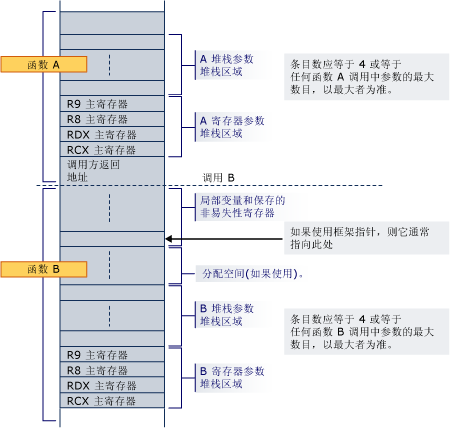

# x64 堆栈使用情况

超出 RSP 的当前地址的所有内存均都视为易失性：OS 或调试程序，可能会在用户调试会话或中断处理程序过程覆盖此内存。 因此，RSP 必须始终设置然后再尝试读取或写入到堆栈帧的值。

本部分讨论的本地变量的堆栈空间分配和**alloca**内部函数。

## 堆栈分配

函数的 prolog 负责对本地变量分配堆栈空间，保存的寄存器，堆栈参数，并注册参数。

参数区域始终位于堆栈的底部 (即使`alloca`使用)，以便它将始终为旁边的寄信人地址的任何函数调用过程。 它包含至少四个条目，但始终足够空间来保留所有参数的所需的不能调用任何函数。 请注意，即使参数本身永远不会托管到堆栈; 始终为寄存器参数分配空间为所有参数分配了空间保证被调用方。 这样的相邻区域才可以使用在所调用的函数需要参数列表 (va_list) 或单个自变量的地址的情况下，家庭地址不需要将寄存器自变量。 此区域还提供了方便的位置，若要在转换 （thunk） 执行期间以及作为调试选项保存寄存器自变量 （例如，它可以轻松自变量就存储在他们的家庭住址在 prolog 代码中在调试期间查找）。 即使被调用的函数具有少于 4 个参数，这些 4 堆栈位置有效地归被调用函数，并可能会用于其他目的除了保存寄存器值的参数调用的函数。  因此调用方可能未保存的信息在堆栈的此区域中跨函数调用。

如果动态分配空间 (`alloca`) 在函数中，则非易失寄存器必须使用帧指针为标记的固定部分，堆栈的基础的并且必须保存并初始化在序言中注册。 请注意，当`alloca`是使用，从相同的调用方调用同一个被调用方可能有不同的内部地址，为其注册参数。

堆栈将始终保持不变 16 字节对齐，除外 （例如，推送到的回邮地址后），prolog 中，除非中的指示位置[函数类型](#function-types)对于框架函数的某一类。

下面是其中函数的调用非叶函数 B.函数 A 的序言的堆栈布局的示例已为所有寄存器和堆栈所都需的参数在堆栈的底部 B 已分配空间。 该调用将返回地址和 B 的 prolog 为其本地变量、 非易失寄存器和它调用的函数所需的空间分配空间。 如果 B 使用`alloca`，保存区域的本地变量/非易失性寄存器和参数堆栈区域之间分配的空间。

当函数 B 调用另一个函数时，返回地址正下方的家庭地址按以 RCX 中。

## 构造动态参数堆栈区域

如果使用帧指针，则选项，用于动态创建的参数堆栈区域。 不目前这是在 x64 编译器。

## 函数类型

基本上，有两种类型的函数。 需要一个堆栈帧的函数称为*帧函数*。 调用不需要的堆栈帧的函数*叶函数*。

帧函数是分配堆栈空间、 调用其他函数中，将非易失寄存器保存或使用异常处理的函数。 它还需要函数表条目。 帧函数需要一个 prolog 和 epilog。 帧函数可以动态地分配堆栈空间，并可以使用帧指针。 框架函数具有的全部功能调用其可供使用的标准。

如果帧函数不会调用另一个函数，则不需要对齐堆栈 (部分中提到[堆栈分配](#stack-allocation))。

叶函数是一个不需要函数表条目。 它不能为任何非易失性寄存器，包括 RSP，这意味着它不能调用任何函数或分配堆栈空间进行更改。 它允许它执行的同时保留堆栈未对齐。

## malloc 对齐

[malloc](../c-runtime-library/reference/malloc.md)保证返回的存储具有基础对齐方式，且任何对象分配的内存量无法容纳，适当对齐的内存。 一个*基本对齐*是小于或等于而无需对齐方式规范实现支持的最大对齐对齐方式。 (在视觉对象C++，这是所需的对齐方式`double`，或 8 个字节。 在针对 64 位平台的代码中，是 16 个字节。）例如，将支持四个字节或更小的任何对象的边界上对齐 4 字节分配。

VisualC++允许具有*扩展对齐方式*，也称为*过对齐*类型。 例如，SSE 类型[__m128](../cpp/m128.md)并`__m256`，并通过使用声明的类型`__declspec(align( n ))`其中`n`大于 8、 具有扩展对齐方式。 不保证适用于需要扩展对齐方式的对象的边界上的内存对齐`malloc`。 若要为过对齐类型分配内存，请使用[_aligned_malloc](../c-runtime-library/reference/aligned-malloc.md)和相关函数。

## alloca

[_alloca](../c-runtime-library/reference/alloca.md)必须是 16 字节对齐，此外还要求使用帧指针。

堆栈分配的需要之后它包含空格，随后被调用函数的参数中所述[堆栈分配](#stack-allocation)。

## 请参阅

[x64 软件约定](../build/x64-software-conventions.md) 
[align](../cpp/align-cpp.md) 
[__declspec](../cpp/declspec.md)
