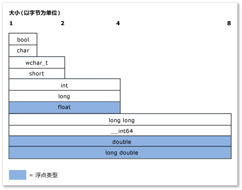

---
title: C++ 类型系统
ms.date: 11/19/2019
ms.topic: conceptual
ms.assetid: 553c0ed6-77c4-43e9-87b1-c903eec53e80
ms.openlocfilehash: cbe0b4421d2e7727b919dfaf20218b8da03ea871
ms.sourcegitcommit: 1f009ab0f2cc4a177f2d1353d5a38f164612bdb1
ms.translationtype: MT
ms.contentlocale: zh-CN
ms.lasthandoff: 07/27/2020
ms.locfileid: "87228981"
---
# <a name="c-type-system"></a>C++ 类型系统

在 c + + 中，*类型*的概念非常重要。 每个变量、函数自变量和函数返回值必须具有一个类型以进行编译。 此外，在计算表达式前，编译器会给出每个表达式（包括文本值）的隐式类型。 类型的一些示例包括 **`int`** 存储整数值、 **`double`** 存储浮点值（也称为*标量*数据类型）或标准库类[std：： basic_string](../standard-library/basic-string-class.md)存储文本。 可以通过定义或创建自己的类型 **`class`** **`struct`** 。 该类型指定将分配给变量（或表达式结果）的内存量、可能存储在该变量中的值类型、如何对那些值（作为位模式）进行说明以及可对其执行的操作。 本文包含对 C++ 类型系统的主要功能的非正式概述。

## <a name="terminology"></a>术语

**变量**：数据量的符号名，以便可以使用该名称访问它在定义它的代码范围内所引用的数据。 在 c + + 中，*变量*通常用于引用标量数据类型的实例，而其他类型的实例通常称为 "*对象*"。

**对象**：为了简单和一致性，本文使用 term*对象*来引用类或结构的任何实例，而当它在一般意义上使用时，包括所有类型，甚至是标量变量。

**POD 类型**（纯旧数据）： c + + 中的这一非正式数据类型是指标量的类型（请参见基本类型部分）或是*POD 类*。 POD 类没有不是 POD 的静态数据成员，没有用户定义的构造函数、用户定义的析构函数或用户定义的赋值运算符。 此外，POD 类无虚函数、基类、私有的或受保护的非静态数据成员。 POD 类型通常用于外部数据交换，例如与用 C 语言编写的模块（仅具有 POD 类型）进行的数据交换。

## <a name="specifying-variable-and-function-types"></a>指定变量和函数类型

C + + 是一种*强类型*语言，它也是*静态类型化*的。每个对象都有一个类型，且该类型永远不会更改（不会与静态数据对象混淆）。 在代码中声明变量时，必须显式指定其类型，或者使用 **`auto`** 关键字指示编译器从初始值设定项推断类型。 在代码中声明函数时，必须指定每个参数的类型及其返回值; **`void`** 如果函数未返回任何值，则必须指定其返回值。 例外情况是，当使用允许任意类型参数的函数模板时。

在你首次声明变量后，稍后无法更改其类型。 但是，你可以将变量的值或函数的返回值复制到其他类型的另一个变量中。 此类操作称为*类型转换*，有时是必需的，但也是数据丢失或不正确的潜在来源。

在声明 POD 类型的变量时，强烈建议你将其初始化，也就是为其指定初始值。 在初始化某个变量之前，该变量会有一个“垃圾”值，该值包含之前正好位于该内存位置的位数。 这是需要注意的 C++ 的一个重要方面，尤其是当你使用另一种语言来处理初始化时。 如果声明非 POD 类类型的变量，则构造函数会处理初始化。

下面的示例演示了一些简单变量声明，并分别对它们进行了说明。 该示例还演示了编译器如何使用类型信息允许或禁止对变量进行某些后续操作。

```cpp
int result = 0;              // Declare and initialize an integer.
double coefficient = 10.8;   // Declare and initialize a floating
                             // point value.
auto name = "Lady G.";       // Declare a variable and let compiler
                             // deduce the type.
auto address;                // error. Compiler cannot deduce a type
                             // without an intializing value.
age = 12;                    // error. Variable declaration must
                             // specify a type or use auto!
result = "Kenny G.";         // error. Can’t assign text to an int.
string result = "zero";      // error. Can’t redefine a variable with
                             // new type.
int maxValue;                // Not recommended! maxValue contains
                             // garbage bits until it is initialized.
```

## <a name="fundamental-built-in-types"></a>基本（内置）类型

不同于某些语言，C++ 中不存在派生所有其他类型的通用基类型。 该语言包含许多*基本类型*，也称为*内置类型*。 这包括数字类型，例如 **`int`** 、、、 **`double`** ，以及 **`long`** **`bool`** **`char`** **`wchar_t`** ASCII 和 UNICODE 字符的和类型。 大多数基础类型（除 **`bool`** 、 **`double`** 、 **wc.exe `har_t** and related types) all have unsigned versions, which modify the range of values that the variable can store. For example, an **` int `**, which stores a 32-bit signed integer, can represent a value from -2,147,483,648 to 2,147,483,647. An **` 无符号 int "**，它也存储为32位）可以存储0到4294967295之间的值。 可能的值的总数在每种情况下都相同；仅范围不同。

基础类型由编译器识别，编译机包含内置规则，这些规则管理可对它们执行的操作以及将它们转换为其他基础类型的方式。 有关内置类型及其大小和数值限制的完整列表，请参阅[内置类型](../cpp/fundamental-types-cpp.md)。

下图显示了内置类型的相对大小：



下表列出了最常用的基础类型：

|类型|大小|评论|
|----------|----------|-------------|
|int|4 个字节|整数值的默认选择。|
|Double|8 字节|浮点值的默认选择。|
|bool|1 字节|表示可为 true 或 false 的值。|
|char|1 字节|用于早期 C 样式字符串或 std:: 字符串对象中无需转换为 UNICODE 的 ASCII 字符。|
|wchar_t|2 个字节|表示可能以 UNICODE 格式进行编码的“宽”字符值（Windows 上为 UTF-16，其他操作系统上可能不同）。 这是用于 `std::wstring` 类型字符串的字符类型。|
|无符号 &nbsp; 字符|1 字节|C + + 没有内置字节类型。  用于 **`unsigned char`** 表示字节值。|
|unsigned int|4 个字节|位标志的默认选项。|
|long long|8 字节|表示非常大的整数值。|

## <a name="the-void-type"></a>void 类型

**`void`** 类型是一种特殊类型; 你不能声明类型的变量 **`void`** ，但你可以声明一个__void \* __类型的变量（指向的指针 **`void`** ），这在分配原始（非类型化）内存时有时是必需的。 但是，指向 **`void`** 的指针不是类型安全的，通常不建议在新式 c + + 中使用。 在函数声明中， **`void`** 返回值表示函数不返回值; 这是的常见和可接受用法 **`void`** 。 尽管 C 语言需要具有零个参数的函数 **`void`** 在参数列表中声明（例如），但 `fou(void)` 在现代 c + + 中不建议使用这种做法，应声明这种做法 `fou()` 。 有关详细信息，请参阅[类型转换和类型安全性](../cpp/type-conversions-and-type-safety-modern-cpp.md)。

## <a name="const-type-qualifier"></a>const 类型限定符

任何内置或用户定义的类型都可由 const 关键字限定。 此外，成员函数可以是 **`const`** 限定的，甚至是 **`const`** 重载的。 类型的值在 **`const`** 初始化后无法修改。

```cpp

const double PI = 3.1415;
PI = .75 //Error. Cannot modify const variable.
```

**`const`** 限定符在函数和变量声明中广泛使用，"const 正确性" 是 c + + 中的一个重要概念; 实质上意味着使用 **`const`** 来保证在编译时不会无意中修改这些值。 有关详细信息，请参阅 [`const`](../cpp/const-cpp.md)。

**`const`** 类型与其非常量版本不同; 例如， **`const int`** 是中的不同类型 **`int`** 。 **`const_cast`** 如果必须从变量中删除*常量*，则可以在这种罕见情况下使用 c + + 运算符。 有关详细信息，请参阅[类型转换和类型安全性](../cpp/type-conversions-and-type-safety-modern-cpp.md)。

## <a name="string-types"></a>字符串类型

严格地说，c + + 语言没有内置的字符串类型;**`char`** 和 **`wchar_t`** 存储单个字符-您必须声明这些类型的数组以接近字符串，并将一个终止 null 值（例如，ASCII）添加 `'\0'` 到最后一个有效字符之后的数组元素（也称为*C 样式字符串*）。 C 样式字符串需要编写更多的代码或者需要使用外部字符串实用工具库函数。 但在现代 c + + 中，我们具有标准库类型 `std::string` （适用于8位 **`char`** 类型字符串）或 `std::wstring` （适用于16位 **`wchar_t`** 类型字符串）。 可以将这些 c + + 标准库容器视为本机字符串类型，因为它们是包含在任何兼容的 c + + 生成环境中的标准库的一部分。 只需使用 `#include <string>` 指令即可使这些类型在你的程序中可用。 （如果使用的是 MFC 或 ATL， `CString` 类也可用，但不是 c + + 标准的一部分。）强烈建议不要在现代 c + + 中使用 null 终止字符数组（前面提到的 C 样式字符串）。

## <a name="user-defined-types"></a>用户定义类型

在定义 **`class`** 、 **`struct`** 、或时 **`union`** ，将 **`enum`** 在代码的其余部分使用该构造，就像它是一种基本类型一样。 它具有内存的已知大小以及一些有关可以如何在程序生命期内将其用于编译时检查和运行时的规则。 基本内置类型和用户定义的类型之间的主要区别如下：

- 编译器没有用户定义的类型的内置知识。 它在编译过程中首次遇到此定义时学习类型。

- 通过定义（通过重载）适当的运算符作为类成员或非成员函数，可以指定可对你的类型执行的操作以及你的类型转换为其他类型的方式。 有关详细信息，请参阅[函数重载](function-overloading.md)

## <a name="pointer-types"></a>指针类型

可追溯返回到最早版本的 C 语言，c + + 继续允许使用特殊声明符（星号）声明指针类型的变量 **`*`** 。 指针类型在存储实际数据值的内存中存储位置地址。 在现代 c + + 中，这些称为 "*原始指针*"，通过特殊运算符 **`*`** （星号）或 **`->`** （带大于号的短划线）在代码中访问。 这称为取消*引用*，使用哪一个取决于您是要取消引用指向对象中成员的标量还是指向成员的指针。 使用指针类型很长时间以来都是 C 和 C++ 程序开发的最具挑战性和最难以理解的方面之一。 本部分概述了一些事实和实践，以帮助使用原始指针（如果需要），但在现代 c + + 中，由于[智能指针](../cpp/smart-pointers-modern-cpp.md)的发展（在本节末尾讨论了更多的内容），不再需要（或推荐）使用原始指针来实现对象所有权。 使用原始指针来观察对象仍是有用且安全的，但如果必须将其用于对象所有权，则需要谨慎操作并仔细考虑如何创建和销毁其所有的对象。

首先你应该知道的是，声明一个原始指针变量只会分配存储了取消指针时需引用的内存地址的内存。 尚未分配数据值本身（也称为*后备存储*）的内存分配。 换言之，通过声明原始指针变量，将创建内存地址变量而非实际数据变量。 在确保指针变量包含指向备份存储的有效地址前取消对其的引用将导致程序发生未定义行为（通常为严重错误）。 下面的示例演示了此种错误：

```cpp
int* pNumber;       // Declare a pointer-to-int variable.
*pNumber = 10;      // error. Although this may compile, it is
                    // a serious error. We are dereferencing an
                    // uninitialized pointer variable with no
                    // allocated memory to point to.
```

该示例取消引用指针类型，未分配用于存储实际整数数据的任何内存或向其分配有效内存地址。 下面的代码更正这些错误：

```cpp
    int number = 10;          // Declare and initialize a local integer
                              // variable for data backing store.
    int* pNumber = &number;   // Declare and initialize a local integer
                              // pointer variable to a valid memory
                              // address to that backing store.
...
    *pNumber = 41;            // Dereference and store a new value in
                              // the memory pointed to by
                              // pNumber, the integer variable called
                              // "number". Note "number" was changed, not
                              // "pNumber".
```

已纠正的代码示例使用本地堆栈内存创建 `pNumber` 指向的后备存储。 我们使用基本类型，以求简单。 在实践中，指针的后备存储最常是用户定义的类型，这些类型是通过使用*free store*关键字表达式（在 c 样式编程中，使用的是较旧的 c 运行时库函数），动态分配到使用*heap* **`new`** 关键字表达式（在 c 样式编程中）的内存区域中 `malloc()` 。 分配后，这些变量通常称为对象，尤其是在它们基于类定义时。 用分配的内存 **`new`** 必须由相应的 **`delete`** 语句删除（或者，如果使用 `malloc()` 函数来分配它，则为 C 运行时函数 `free()` ）。

但是，很容易忘记删除动态分配的对象（尤其是在复杂代码中），这会导致资源 bug 被称为*内存泄露*。 为此，强烈建议你不要在现代 C++ 中使用原始指针。 最好始终将原始指针包装到[智能指针](../cpp/smart-pointers-modern-cpp.md)中，这会在调用析构函数时自动释放内存（当代码超出智能指针的范围时）;通过使用智能指针，你几乎可以消除 c + + 程序中的整个 bug 类。 在下面的示例中，假定 `MyClass` 是具有公共方法 `DoSomeWork();` 的用户定义的类型

```cpp
void someFunction() {
    unique_ptr<MyClass> pMc(new MyClass);
    pMc->DoSomeWork();
}
  // No memory leak. Out-of-scope automatically calls the destructor
  // for the unique_ptr, freeing the resource.
```

有关智能指针的详细信息，请参阅[智能指针](../cpp/smart-pointers-modern-cpp.md)。

有关指针转换的详细信息，请参阅[类型转换和类型安全](../cpp/type-conversions-and-type-safety-modern-cpp.md)。

有关一般指针的详细信息，请参阅[指针](../cpp/pointers-cpp.md)。

## <a name="windows-data-types"></a>Windows 数据类型

在 C 和 c + + 的经典 Win32 编程中，大多数函数使用 Windows 特定的 typedef 和 `#define` 宏（在中定义 `windef.h` ）来指定参数类型和返回值。 这些 Windows 数据类型主要是为 C/c + + 内置类型提供的特殊名称（别名）。 有关这些 typedef 和预处理器定义的完整列表，请参阅[Windows 数据类型](/windows/win32/WinProg/windows-data-types)。 其中一些 typedef （如 `HRESULT` 和）非常 `LCID` 有用，并且具有描述性。 其他类（如 `INT` ）没有特殊含义，并且只是基础 c + + 类型的别名。 其他 Windows 数据类型的名称自 C 编程和 16 位处理器得到保留，并且在现代硬件或操作系统中不具有目的和意义。 还有与 Windows 运行时库关联的特殊数据类型，作为[Windows 运行时基本数据类型](/windows/win32/WinRT/base-data-types)列出。 在现代 C++ 中，一般准则是首选 C++ 基本类型，除非 Windows 类型传达一些有关如何解释值的附加意义。

## <a name="more-information"></a>更多信息

有关 C++ 类型系统的更多信息，请参见下列主题。

[值类型](../cpp/value-types-modern-cpp.md)\
描述*值类型*以及与其使用相关的问题。

[类型转换和类型安全](../cpp/type-conversions-and-type-safety-modern-cpp.md)\
描述常见类型转换问题并说明如何避免这些问题出现。

## <a name="see-also"></a>另请参阅

[欢迎回到 c + +](../cpp/welcome-back-to-cpp-modern-cpp.md)<br/>
[C++ 语言参考](../cpp/cpp-language-reference.md)<br/>
[C + + 标准库](../standard-library/cpp-standard-library-reference.md)
