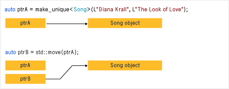

# 如何：创建和使用 unique_ptr 实例
[!INCLUDE[vs2017banner](../assembler/inline/includes/vs2017banner.md)]

[unique\_ptr](../standard-library/unique-ptr-class.md) 不共享它的指针。  它无法复制到其他 `unique_ptr`，无法通过值传递到函数，也无法用于需要副本的任何标准模板库 \(STL\) 算法。  只能移动 `unique_ptr`。  这意味着，内存资源所有权将转移到另一 `unique_ptr`，并且原始 `unique_ptr` 不再拥有此资源。  我们建议你将对象限制为由一个所有者所有，因为多个所有权会使程序逻辑变得复杂。  因此，当需要智能指针用于纯 C\+\+ 对象时，可使用 `unique_ptr`，而当构造 `unique_ptr` 时，可使用 [make\_unique](../Topic/make_unique.md) Helper 函数。  
  
 下图演示了两个 `unique_ptr` 实例之间的所有权转换。  
  
   
  
 `unique_ptr` 在 STL 的 `<memory>` 标头中定义。  它与原始指针一样有效，并可用于 STL 容器。  将 `unique_ptr` 实例添加到 STL 容器很有效，因为通过 `unique_ptr` 的移动构造函数，不再需要进行复制操作。  
  
## 示例  
 以下示例演示如何创建 `unique_ptr` 实例并在函数之间传递这些实例。  
  
 [!code-cpp[stl_smart_pointers#210](../cpp/codesnippet/CPP/how-to-create-and-use-unique-ptr-instances_1.cpp)]  
  
 这些示例说明了 `unique_ptr` 的基本特征：可移动，但不可复制。“移动”将所有权转移到新 `unique_ptr` 并重置旧 `unique_ptr`。  
  
## 示例  
 以下示例演示如何创建 `unique_ptr` 实例并在向量中使用这些实例。  
  
 [!code-cpp[stl_smart_pointers#211](../cpp/codesnippet/CPP/how-to-create-and-use-unique-ptr-instances_2.cpp)]  
  
 在 range for 循环中，注意 `unique_ptr` 通过引用来传递。  如果你尝试通过此处的值传递，由于删除了 `unique_ptr` 复制构造函数，编译器将引发错误。  
  
## 示例  
 以下示例演示如何初始化类成员 `unique_ptr`。  
  
 [!code-cpp[stl_smart_pointers#212](../cpp/codesnippet/CPP/how-to-create-and-use-unique-ptr-instances_3.cpp)]  
  
## 示例  
 可使用 [make\_unique](../Topic/make_unique.md) 将 `unique_ptr` 创建到数组，但无法使用 `make_unique` 初始化数组元素。  
  
 [!code-cpp[stl_smart_pointers#213](../cpp/codesnippet/CPP/how-to-create-and-use-unique-ptr-instances_4.cpp)]  
  
 有关更多示例，请参见[make\_unique](../Topic/make_unique.md)。  
  
## 请参阅  
 [智能指针](../cpp/smart-pointers-modern-cpp.md)   
 [make\_unique](../Topic/make_unique.md)