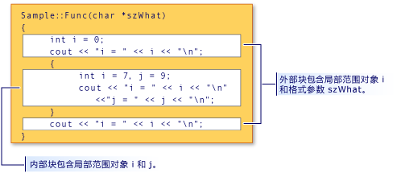

# 范围 (Visual C++)
[!INCLUDE[vs2017banner](../assembler/inline/includes/vs2017banner.md)]

只能在程序的某些区域内使用 C\+\+ 名称。  此区域称为名称的“范围”。  范围决定一个不表示静态范围的对象的名称的“生存期”。  在以下情况下，范围还可决定名称的可见性：调用类构造函数或析构函数时，或初始化范围的局部变量时。  （有关详细信息，请参阅[构造函数](../cpp/constructors-cpp.md)和[析构函数](../cpp/destructors-cpp.md)。） 有五种范围：  
  
-   **局部范围** 块中声明的名称仅在该块中以及由它封闭的块中是可访问的，并且仅在声明点后可访问。  函数的最外层块的范围中的函数形参的名称具有局部范围，就像已在包含函数主体的块中声明了它们一样。  考虑以下代码片断：  
  
    ```  
    {  
        int i;  
    }  
    ```  
  
     由于 `i` 的声明位于包含在大括号内的块中，因此，`i` 具有局部范围且绝对不可访问，因为右大括号之前没有代码访问它。  
  
-   **函数范围** 标签是具有函数范围的唯一名称。  它们可以在函数内的任意位置使用，但在函数外部是不可访问的。  用于函数的形参（函数定义中指定的参数）被视为在函数体的最外层块的范围内。  
  
-   **文件范围** 在所有模块或类的外部声明的任何名称都具有文件范围。  它在其声明后的翻译单元中的任意位置都是可访问的。  不声明静态对象的带文件范围的名称通常称为全局名称。  
  
     在 C\+\+ 中，文件范围也称为命名空间范围。  
  
-   **类范围** 类成员的名称具有类范围。  只能通过在对象上使用成员选择运算符（**.** 或 **–\>**）或指向成员的指针运算符（**.\*** 或 **–\>\***）或使用执行该类的对象的指针才能访问类成员函数；非静态成员数据被视为该类的对象的本地数据。  考虑下列类声明：  
  
    ```  
    class Point  
    {  
        int x;  
        int y;  
    };  
    ```  
  
     类成员 `x` 和 `y` 被认为在类 `Point` 的范围内。  
  
-   **原型范围** 函数原型中声明的名称仅在原型的末尾可见。  以下原型声明了三个名称（`strDestination`、`numberOfElements` 和 `strSource`）；这些名称超出了原型末尾的范围：  
  
    ```  
    errno_t strcpy_s( char *strDestination, size_t numberOfElements, const char *strSource );  
    ```  
  
## 隐藏名称  
 可通过在封闭块中声明名称来隐藏该名称。  在下图中，在内部块中重新声明 `i`，从而隐藏与外部块范围中的 `i` 关联的变量。  
  
   
块范围和名称隐藏  
  
 来自图中显示的程序的输出为：  
  
```  
i = 0  
i = 7  
j = 9  
i = 0  
```  
  
> [!NOTE]
>  参数 `szWhat` 被视为处于函数的范围内。  因此，它被当做就像已在函数的最外层块中声明一样。  
  
## 隐藏类名  
 通过声明同一范围内的函数、对象或变量或枚举器，可以隐藏类名称。  但是，在关键字 **class** 作为前缀时仍可以访问类名称。  
  
```  
// hiding_class_names.cpp  
// compile with: /EHsc  
#include <iostream>  
using namespace std;  
  
// Declare class Account at file scope.  
class Account  
{  
public:  
    Account( double InitialBalance )  
        { balance = InitialBalance; }  
    double GetBalance()  
        { return balance; }  
private:  
    double balance;  
};  
  
double Account = 15.37;            // Hides class name Account  
  
int main()  
{  
    class Account Checking( Account ); // Qualifies Account as   
                                       //  class name  
  
    cout << "Opening account with balance of: "  
         << Checking.GetBalance() << "\n";  
}  
//Output: Opening account with balance of: 15.37  
```  
  
> [!NOTE]
>  在任何位置调用类名称 \(`Account`\)，关键字类都必须用于将其与文件范围内的变量 Account 区分开来。  当类名出现在范围解析运算符 \(::\) 的左侧时，此规则不适用。  在范围解析运算符的左侧的名称始终被视为类名称。  
  
 下面的示例演示如何使用 `Account`class 关键字声明指向类型  **的对象的指针：**  
  
```  
class Account *Checking = new class Account( Account );  
```  
  
 前面的语句中的初始值设定项（括号内）的 `Account` 包含文件范围；它的类型为 **double**。  
  
> [!NOTE]
>  此示例中所示的标识符名称的重用被视为较差的编程样式。  
  
 有关指针的详细信息，请参阅[派生类型](http://msdn.microsoft.com/zh-cn/aa14183c-02fe-4d81-95fe-beddb0c01c7c)。  有关类对象的声明和初始化的信息，请参阅[类、结构和联合](../cpp/classes-and-structs-cpp.md)。  有关使用 **new** 和 **delete** 自由存储运算符的信息，请参阅[特殊成员函数](../misc/special-member-functions-cpp.md)。  
  
## 隐藏具有文件范围的名称  
 通过在块范围中显式声明相同的名称，可以隐藏带文件范围的名称。  但是，可以使用范围解析运算符 \(`::`\) 访问文件范围名称。  
  
```  
// file_scopes.cpp  
// compile with: /EHsc  
#include <iostream>  
  
int i = 7;   // i has file scope, outside all blocks  
using namespace std;  
  
int main( int argc, char *argv[] ) {  
   int i = 5;   // i has block scope, hides i at file scope  
   cout << "Block-scoped i has the value: " << i << "\n";  
   cout << "File-scoped i has the value: " << ::i << "\n";  
}  
```  
  
  **块范围内的 i 具有的值为 5**  
**文件范围内的 i 具有的值为 7**   
## 请参阅  
 [基本概念](../cpp/basic-concepts-cpp.md)