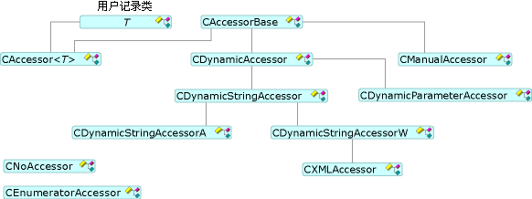

# 访问器和行集合

若要设置和检索数据，OLE DB 模板使用一个访问器和通过行集[CAccessorRowset](../../data/oledb/caccessorrowset-class.md)类。 此类可以处理不同类型的多个访问器。  
  
## 访问器类型  

所有访问器派生[CAccessorBase](../../data/oledb/caccessorbase-class.md)。 `CAccessorBase` 提供参数和列绑定。  
  
下图显示了访问器类型。  
  
  
访问器类  
  
- [CAccessor](../../data/oledb/caccessor-class.md)在设计时知道数据库源的结构时使用此访问器。 `CAccessor` 以静态方式将数据库记录，其中包含缓冲区，绑定到数据源。  
  
- [CDynamicAccessor](../../data/oledb/cdynamicaccessor-class.md)在设计时不知道数据库的结构时使用此访问器。 `CDynamicAccessor` 调用`IColumnsInfo::GetColumnInfo`若要获取的数据库列信息。 它创建和管理取值函数和缓冲区。  
  
- [CDynamicParameterAccessor](../../data/oledb/cdynamicparameteraccessor-class.md)使用此访问器来处理未知的命令类型。 在准备命令时`CDynamicParameterAccessor`即可获取参数信息从`ICommandWithParameters`接口，如果提供程序支持`ICommandWithParameters`。  
  
- [CDynamicStringAccessor](../../data/oledb/cdynamicstringaccessor-class.md)， [CDynamicStringAccessorA](../../data/oledb/cdynamicstringaccessora-class.md)，和[CDynamicStringAccessorW](../../data/oledb/cdynamicstringaccessorw-class.md)在不知道数据库架构时使用这些类。 `CDynamicStringAccessorA` 数据检索为 ANSI 字符串;`CDynamicStringAccessorW`检索数据作为 Unicode 字符串。  
  
- [CManualAccessor](../../data/oledb/cmanualaccessor-class.md)通过此类，可以使用提供程序可以转换该类型如果所需的任何数据类型。 它处理结果列和命令参数。  
  
下表总结了中的 OLE DB 模板访问器类型的支持。  
  
|取值函数类型|动态|句柄 params|缓冲区|多个访问器|  
|-------------------|-------------|--------------------|------------|------------------------|  
|`CAccessor`|否|是|“用户”|是|  
|`CDynamicAccessor`|是|否|OLE DB 模板|否|  
|`CDynamicParameterAccessor`|是|是|OLE DB 模板|否|  
|`CDynamicStringAccessor[A,W]`|是|否|OLE DB 模板|否|  
|`CManualAccessor`|是|是|“用户”|是|  
  
## 行集合类型  

OLE DB 模板支持三种类型的行集 （请参阅上图中）： 单一行集 (由实现[CRowset](../../data/oledb/crowset-class.md))，大容量行集 (由实现[CBulkRowset](../../data/oledb/cbulkrowset-class.md))，和数组 （实现行集通过[CArrayRowset](../../data/oledb/carrayrowset-class.md))。 单个行集提取单个行句柄时`MoveNext`调用。 大容量行集可以提取多个行句柄。 数组行集是可使用数组语法访问的行集。  
  
下图显示了行集类型。  
  
  
行集类  
  
[架构行集](../../data/oledb/obtaining-metadata-with-schema-rowsets.md)执行不访问数据中的数据存储，但改为访问有关数据存储，称为元数据的信息。 在其中的数据库结构不在编译时已知，并且必须在运行时获取的情况下通常用于架构行集。  
  
## 请参阅  

[OLE DB 使用者模板](../../data/oledb/ole-db-consumer-templates-cpp.md)