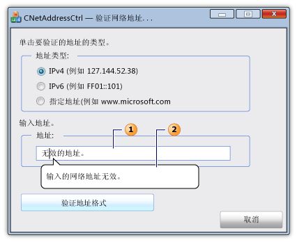

# <a name="cnetaddressctrl-class"></a>CNetAddressCtrl 类

`CNetAddressCtrl` 类表示网络地址控件，可使用此控件输入和验证 IPv4、IPv6 与命名的 DNS 地址的格式。

## <a name="syntax"></a>语法

```
class CNetAddressCtrl : public CEdit
```

## <a name="members"></a>成员

### <a name="public-constructors"></a>公共构造函数

|“属性”|描述|
|----------|-----------------|
|[CNetAddressCtrl：： CNetAddressCtrl](#cnetaddressctrl)|构造 `CNetAddressCtrl` 对象。|

### <a name="public-methods"></a>公共方法

|“属性”|描述|
|----------|-----------------|
|[CNetAddressCtrl：： Create](#create)|使用指定的样式创建一个网络地址控件，并将其附加到当前 `CNetAddressCtrl` 对象。|
|[CNetAddressCtrl：： CreateEx](#createex)|使用指定的扩展样式创建一个网络地址控件，并将其附加到当前 `CNetAddressCtrl` 对象。|
|[CNetAddressCtrl：:D isplayErrorTip](#displayerrortip)|当用户在 "当前网络地址" 控件中输入不受支持的网络地址时，将显示错误气球提示。|
|[CNetAddressCtrl：： GetAddress](#getaddress)|检索与当前网络地址控件关联的网络地址的经过验证和分析的表示形式。|
|[CNetAddressCtrl：： GetAllowType](#getallowtype)|检索当前网络地址控件可以支持的网络地址的类型。|
|[CNetAddressCtrl：： SetAllowType](#setallowtype)|设置当前网络地址控件可以支持的网络地址的类型。|

## <a name="remarks"></a>备注

网络地址控件验证用户输入的地址格式是否正确。 控件实际上不会连接到网络地址。 [CNetAddressCtrl：： SetAllowType](#setallowtype)方法指定[CNetAddressCtrl：： GetAddress](#getaddress)方法可分析和验证的一种或多种类型的地址。 服务器、网络、主机或广播消息目标的地址可以采用 IPv4、IPv6 或命名地址的形式。 如果地址的格式不正确，则可以使用 [CNetAddressCtrl：:D isplayerrortip](#displayerrortip) 方法显示以图形方式指向网络地址控件文本框的信息提示消息框，并显示预定义的错误消息。

此 `CNetAddressCtrl` 类派生自 [CEdit](../../mfc/reference/cedit-class.md) 类。 因此，网络地址控件提供对所有 Windows 编辑控制消息的访问权限。

下图描绘了包含网络地址控件的对话框。 网络地址控件 (1) 的文本框包含无效的网络地址。 如果网络地址无效，则显示提示消息 (2) 。



## <a name="examples"></a>示例

下面的代码示例是一个对话框的一部分，用于验证网络地址。 三个单选按钮的事件处理程序指定网络地址可以为三种类型之一。 用户在网络控件的文本框中输入一个地址，然后按某个按钮来验证该地址。 如果该地址有效，将显示一条成功消息;否则，将显示预定义的信息提示错误消息。

[!code-cpp[NVC_MFC_CNetAddressCtrl_s1#1](../../mfc/reference/codesnippet/cpp/cnetaddressctrl-class_1.cpp)]

以下来自对话框头文件的代码示例定义了[CNetAddressCtrl：： GetAddress](#getaddress)方法所需的[NC_ADDRESS](/windows/win32/api/shellapi/ns-shellapi-nc_address)和[NET_ADDRESS_INFO](/windows/win32/shell/hkey-type)变量。

[!code-cpp[NVC_MFC_CNetAddressCtrl_s1#2](../../mfc/reference/codesnippet/cpp/cnetaddressctrl-class_2.h)]

## <a name="inheritance-hierarchy"></a>继承层次结构

[CObject](../../mfc/reference/cobject-class.md)

[CCmdTarget](../../mfc/reference/ccmdtarget-class.md)

[CWnd](../../mfc/reference/cwnd-class.md)

[CEdit](../../mfc/reference/cedit-class.md)

`CNetAddressCtrl`

## <a name="requirements"></a>要求

**标头：** afxcmn.h

Windows Vista 和更高版本中支持此类。

有关此类的其他要求，请参阅 [Windows Vista 公共控件的生成要求](../../mfc/build-requirements-for-windows-vista-common-controls.md)。

## <a name="cnetaddressctrlcnetaddressctrl"></a><a name="cnetaddressctrl"></a> CNetAddressCtrl：： CNetAddressCtrl

构造 `CNetAddressCtrl` 对象。

```
CNetAddressCtrl();
```

### <a name="remarks"></a>备注

使用 [CNetAddressCtrl：： create](#create) 或 [CNetAddressCtrl：： CreateEx](#createex) 方法创建一个网络控件，并将其附加到 `CNetAddressCtrl` 对象。

## <a name="cnetaddressctrlcreate"></a><a name="create"></a> CNetAddressCtrl：： Create

使用指定的样式创建一个网络地址控件，并将其附加到当前 `CNetAddressCtrl` 对象。

```
virtual BOOL Create(
    DWORD dwStyle,
    const RECT& rect,
    CWnd* pParentWnd,
    UINT nID);
```

### <a name="parameters"></a>parameters

*dwStyle*\
中要应用于控件的样式的按位组合。 有关详细信息，请参阅 [编辑样式](../../mfc/reference/styles-used-by-mfc.md#edit-styles)。

*rect*\
中对包含控件位置和大小的 [RECT](/windows/win32/api/windef/ns-windef-rect) 结构的引用。

*pParentWnd*\
中指向 [CWnd](../../mfc/reference/cwnd-class.md) 对象的非 null 指针，该对象是控件的父窗口。

*nID*\
中控件的 ID。

### <a name="return-value"></a>返回值

如果此方法成功，则为 TRUE;否则为 FALSE。

## <a name="cnetaddressctrlcreateex"></a><a name="createex"></a> CNetAddressCtrl：： CreateEx

使用指定的扩展样式创建一个网络地址控件，并将其附加到当前 `CNetAddressCtrl` 对象。

```
virtual BOOL CreateEx(
    DWORD dwExStyle,
    DWORD dwStyle,
    const RECT& rect,
    CWnd* pParentWnd,
    UINT nID);
```

### <a name="parameters"></a>parameters

*dwExStyle*\
中要应用于控件的扩展样式的按位组合 (或) 。 有关详细信息，请参阅 [CreateWindowEx](/windows/win32/api/winuser/nf-winuser-createwindowexw)函数的 *dwExStyle* 参数。

*dwStyle*\
中要应用于控件的样式的按位组合 (或) 。 有关详细信息，请参阅 [编辑样式](../../mfc/reference/styles-used-by-mfc.md#edit-styles)。

*rect*\
中对包含控件位置和大小的 [RECT](/windows/win32/api/windef/ns-windef-rect) 结构的引用。

*pParentWnd*\
中指向 [CWnd](../../mfc/reference/cwnd-class.md) 对象的非 null 指针，该对象是控件的父窗口。

*nID*\
中控件的 ID。

### <a name="return-value"></a>返回值

如果此方法成功，则为 TRUE;否则为 FALSE。

## <a name="cnetaddressctrldisplayerrortip"></a><a name="displayerrortip"></a> CNetAddressCtrl：:D isplayErrorTip

在气球状提示中显示与当前网络地址控件关联的错误消息。

```
HRESULT DisplayErrorTip();
```

### <a name="return-value"></a>返回值

`S_OK`如果此方法成功，则该值为; 否则为错误代码。

### <a name="remarks"></a>备注

使用 [CNetAddressCtrl：： SetAllowType](#setallowtype) 方法来指定当前网络地址控件可以支持的地址类型。 使用 [CNetAddressCtrl：： GetAddress](#getaddress) 方法来验证和分析用户输入的网络地址。 如果[CNetAddressCtrl：： GetAddress](#getaddress)方法不成功，请使用[CNetAddressCtrl：:D isplayerrortip](#displayerrortip)方法显示错误消息信息提示。

此消息将调用 [NetAddr_DisplayErrorTip](/windows/win32/api/shellapi/nf-shellapi-netaddr_displayerrortip) 宏，Windows SDK 中对此进行了介绍。 该宏将发送 `NCM_DISPLAYERRORTIP` 消息。

## <a name="cnetaddressctrlgetaddress"></a><a name="getaddress"></a> CNetAddressCtrl：： GetAddress

检索与当前网络地址控件关联的网络地址的经过验证和分析的表示形式。

```
HRESULT GetAddress(PNC_ADDRESS pAddress) const;
```

### <a name="parameters"></a>parameters

*pAddress*<br/>
[in，out]指向 [NC_ADDRESS](/windows/win32/api/shellapi/ns-shellapi-nc_address) 结构的指针。  在调用 GetAddress 方法之前，将此结构的 *pAddrInfo* 成员设置为 [NET_ADDRESS_INFO](/windows/win32/shell/hkey-type) 结构的地址。

### <a name="return-value"></a>返回值

如果此方法成功，则值 S_OK;否则为 COM 错误代码。 有关可能的错误代码的详细信息，请参阅 [NetAddr_GetAddress](/windows/win32/api/shellapi/nf-shellapi-netaddr_getaddress) 宏的返回值部分。

### <a name="remarks"></a>备注

如果此方法成功，则 [NET_ADDRESS_INFO](/windows/win32/shell/hkey-type) 结构包含有关网络地址的其他信息。

使用 [CNetAddressCtrl：： SetAllowType](#setallowtype) 方法来指定当前网络地址控件可以支持的地址类型。 使用 [CNetAddressCtrl：： GetAddress](#getaddress) 方法来验证和分析用户输入的网络地址。 如果[CNetAddressCtrl：： GetAddress](#getaddress)方法不成功，请使用[CNetAddressCtrl：:D isplayerrortip](#displayerrortip)方法显示错误消息信息提示。

此方法调用 [NetAddr_GetAddress](/windows/win32/api/shellapi/nf-shellapi-netaddr_getaddress) 宏，Windows SDK 中对此进行了介绍。 该宏将发送 NCM_GETADDRESS 消息。

## <a name="cnetaddressctrlgetallowtype"></a><a name="getallowtype"></a> CNetAddressCtrl：： GetAllowType

检索当前网络地址控件可以支持的网络地址的类型。

```
DWORD GetAllowType() const;
```

### <a name="return-value"></a>返回值

按位组合 (或) 指定网络地址控件可以支持的地址类型的标志。 有关详细信息，请参阅 [NET_STRING](/windows/win32/shell/net-string)。

### <a name="remarks"></a>备注

此消息将调用 [NetAddr_GetAllowType](/windows/win32/api/shellapi/nf-shellapi-netaddr_getallowtype) 宏，Windows SDK 中对此进行了介绍。 该宏将发送 NCM_GETALLOWTYPE 消息。

## <a name="cnetaddressctrlsetallowtype"></a><a name="setallowtype"></a> CNetAddressCtrl：： SetAllowType

设置当前网络地址控件可以支持的网络地址的类型。

```
HRESULT SetAllowType(DWORD dwAddrMask);
```

### <a name="parameters"></a>parameters

*dwAddrMask*\
中按位组合 (或) 指定网络地址控件可以支持的地址类型的标志。 有关详细信息，请参阅 [NET_STRING](/windows/win32/shell/net-string)。

### <a name="return-value"></a>返回值

如果此方法成功，则 S_OK;否则为 COM 错误代码。

### <a name="remarks"></a>备注

使用 [CNetAddressCtrl：： SetAllowType](#setallowtype) 方法来指定当前网络地址控件可以支持的地址类型。 使用 [CNetAddressCtrl：： GetAddress](#getaddress) 方法来验证和分析用户输入的网络地址。 如果[CNetAddressCtrl：： GetAddress](#getaddress)方法不成功，请使用[CNetAddressCtrl：:D isplayerrortip](#displayerrortip)方法显示错误消息信息提示。

此消息将调用 [NetAddr_SetAllowType](/windows/win32/api/shellapi/nf-shellapi-netaddr_setallowtype) 宏，Windows SDK 中对此进行了介绍。 该宏将发送 NCM_SETALLOWTYPE 消息。

## <a name="see-also"></a>请参阅

[CNetAddressCtrl 类](../../mfc/reference/cnetaddressctrl-class.md)<br/>
[层次结构图](../../mfc/hierarchy-chart.md)<br/>
[CEdit 类](../../mfc/reference/cedit-class.md)
