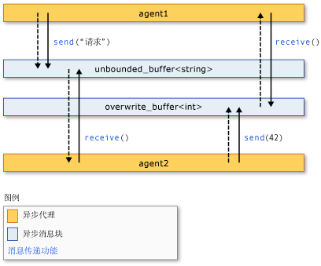

# <a name="asynchronous-agents-library"></a>异步代理库

异步代理库 (或仅) *代理库* 提供了一个编程模型，使你能够提高启用并发的应用程序开发的可靠性。 代理库是一个 c + + 模板库，用于升级基于参与者的编程模型和进程内消息传递以实现粗粒度的数据流和管道任务。 代理库基于并发运行时的计划和资源管理组件构建。

## <a name="programming-model"></a>编程模型

代理库通过允许您通过基于数据流而不是控制流的异步通信模型连接隔离的组件，提供共享状态的替代项。 *数据流* 是指在所有必需数据都可用时进行计算的编程模型; *控制流* 是指在其中按预先确定的顺序进行计算的编程模型。

数据流编程模型与 *消息传递* 这一概念相关，其中程序的独立组件通过发送消息相互通信。

代理库由三个组件组成： *异步代理*、 *异步消息块* 和 *消息传递函数*。 代理维护状态，并使用消息块和消息传递函数与另一个和外部组件通信。 消息传递函数使代理能够与外部组件发送和接收消息。 异步消息块保存消息并使代理能够以同步方式进行通信。

下图显示了两个代理使用消息块和消息传递函数进行通信的方式。 在此图中， `agent1` `agent2` 使用 [concurrency：： send](reference/concurrency-namespace-functions.md#send) 函数和 [concurrency：： unbounded_buffer](reference/unbounded-buffer-class.md) 对象将消息发送到。 `agent2` 使用 [concurrency：： receive](reference/concurrency-namespace-functions.md#receive) 函数读取消息。 `agent2` 使用与相同的方法向发送消息 `agent1` 。 虚线箭头表示代理之间的数据流。 实心箭头将代理连接到它们写入或读取的消息块。



本主题稍后将演示实现此图的代码示例。

与其他并发和同步机制（例如，事件）相比，代理编程模型具有多个优点。 优点之一是，通过使用消息传递在对象之间传输状态更改，你可以隔离对共享资源的访问，从而提高可伸缩性。 消息传递的优点是，它将同步与数据相结合，而不是将其绑定到外部同步对象。 这简化了组件之间的数据传输，并可以消除应用程序中的编程错误。

## <a name="when-to-use-the-agents-library"></a>何时使用代理库

如果有多个必须以异步方式彼此通信的操作，请使用代理库。 消息块和消息传递函数允许你编写并行应用程序，而无需同步机制，如锁。 这使你可以专注于应用程序逻辑。

代理编程模型通常用于创建 *数据管道* 或 *网络*。 数据管道是一系列组件，每个组件都执行一项有助于实现更大目标的特定任务。 数据流管道中的每个组件在从另一个组件收到消息时执行工作。 该工作的结果被传递到管道或网络中的其他组件。 组件可以从其他库使用更细化的并发功能，例如， [并行模式库 (PPL) ](../../parallel/concrt/parallel-patterns-library-ppl.md)。

## <a name="example"></a>示例

下面的示例实现了本主题前面部分中所示的插图。

[!code-cpp[concrt-basic-agents#1](../../parallel/concrt/codesnippet/cpp/asynchronous-agents-library_1.cpp)]

该示例产生下面的输出：

```Output
agent1: sending request...
agent2: received 'request'.
agent2: sending response...
agent1: received '42'.
```

以下主题介绍了此示例中使用的功能。

## <a name="related-topics"></a>相关主题

[异步代理](../../parallel/concrt/asynchronous-agents.md)<br/>
介绍异步代理在求解更多计算任务方面的作用。

[异步消息块](../../parallel/concrt/asynchronous-message-blocks.md)<br/>
介绍代理库提供的各种消息块类型。

[消息传递函数](../../parallel/concrt/message-passing-functions.md)<br/>
介绍代理库提供的各种消息传递例程。

[如何：实现各种 Producer-Consumer 模式](../../parallel/concrt/how-to-implement-various-producer-consumer-patterns.md)<br/>
介绍如何在应用程序中实现制造者-使用者模式。

[如何：向调用和转换器类提供工作函数](../../parallel/concrt/how-to-provide-work-functions-to-the-call-and-transformer-classes.md)<br/>
说明向 [concurrency：： call](../../parallel/concrt/reference/call-class.md) 和 [concurrency：：变压器](../../parallel/concrt/reference/transformer-class.md) 类提供工作函数的几种方法。

[如何：在数据管道中使用转换器](../../parallel/concrt/how-to-use-transformer-in-a-data-pipeline.md)<br/>
演示如何在数据管道中使用 [concurrency：：转换器](../../parallel/concrt/reference/transformer-class.md) 类。

[如何：在已完成的任务之间进行选择](../../parallel/concrt/how-to-select-among-completed-tasks.md)<br/>
演示如何使用 [concurrency：： choice](../../parallel/concrt/reference/choice-class.md) 和 [concurrency：： join](../../parallel/concrt/reference/join-class.md) 类选择完成搜索算法的第一个任务。

[如何：定期发送消息](../../parallel/concrt/how-to-send-a-message-at-a-regular-interval.md)<br/>
演示如何使用 [concurrency：： timer](../../parallel/concrt/reference/timer-class.md) 类定期发送消息。

[如何：使用消息块筛选器](../../parallel/concrt/how-to-use-a-message-block-filter.md)<br/>
演示如何使用筛选器来启用异步消息块，以接受或拒绝消息。

[并行模式库 (PPL)](../../parallel/concrt/parallel-patterns-library-ppl.md)<br/>
介绍如何在应用程序中使用各种并行模式，如并行算法。

[并发运行时](../../parallel/concrt/concurrency-runtime.md)<br/>
描述可以简化并发编程并包含相关主题链接的并发运行时。
