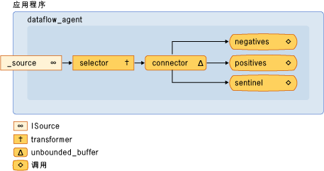

# <a name="walkthrough-creating-a-dataflow-agent"></a>演练：创建数据流代理

本文档演示如何创建基于代理的应用程序基于数据流，而不是控制流。

*控制流*指控制程序中操作的执行顺序。 控制流是通过使用条件语句、 循环等控制结构调整的。 或者，*数据流*指在其中进行计算的所需的所有数据都时才可用的编程模型。 数据流编程模型与在其中程序的独立组件之间的通信通过发送消息的消息传递的概念。

异步代理支持的控制流和数据流编程模型。 尽管控制流时，模式非常适用于许多情况下，数据流模型适合其他情况下，例如，代理接收数据并执行一个操作基于该数据的有效负载。

## <a name="prerequisites"></a>系统必备

在开始本演练之前，请阅读以下文档：

- [异步代理](../../parallel/concrt/asynchronous-agents.md)

- [异步消息块](../../parallel/concrt/asynchronous-message-blocks.md)

- [如何：使用消息块筛选器](../../parallel/concrt/how-to-use-a-message-block-filter.md)

##  <a name="top"></a> 部分

本演练包含以下各节：

- [创建基本的控制流代理](#control-flow)

- [创建基本数据流代理](#dataflow)

- [创建消息日志记录代理](#logging)

##  <a name="control-flow"></a> 创建基本的控制流代理

请考虑下面的示例，用于定义`control_flow_agent`类。 `control_flow_agent`类将在三个消息缓冲区进行操作： 一个输入缓冲区和两个输出缓冲区。 `run`方法从在循环中的源消息缓冲区中读取和使用条件语句来指示程序执行的流程。 该代理递增一个计数器为非零值的负值并递增另一个计数器为非零的正值。 代理收到 sentinel 值为零后，它将计数器的值发送到输出消息缓冲区。 `negatives`和`positives`方法启用应用程序代理从读取正负值的计数。

[!code-cpp[concrt-dataflow-agent#1](../../parallel/concrt/codesnippet/cpp/walkthrough-creating-a-dataflow-agent_1.cpp)]

尽管本示例将代理中的控制流的基本用法，但它演示了基于控制流的编程的序列化性质。 即使多个消息可能是输入的消息缓冲区中可用，必须按顺序处理每条消息。 数据流模型，这两个分支的同时评估的条件语句。 数据流模型还可以创建更复杂的消息传送网络中对数据进行操作变得可用。

[[返回页首](#top)]

##  <a name="dataflow"></a> 创建基本数据流代理

本部分演示如何将转换`control_flow_agent`类来使用数据流模型来执行相同任务。

数据流代理工作原理是创建的消息缓冲区，其中每个都有特定用途的网络。 某些消息块使用筛选器函数来接受或拒绝消息根据其有效负载。 筛选器函数可确保，消息块只接收特定值。

#### <a name="to-convert-the-control-flow-agent-to-a-dataflow-agent"></a>若要将控制流代理转换为数据流代理

1. 复制的正文`control_flow_agent`另一个类，例如，类`dataflow_agent`。 或者，你可以重命名`control_flow_agent`类。

1. 调用的循环主体中删除`receive`从`run`方法。

[!code-cpp[concrt-dataflow-agent#2](../../parallel/concrt/codesnippet/cpp/walkthrough-creating-a-dataflow-agent_2.cpp)]

1. 在`run`方法中变量的初始化`negative_count`并`positive_count`，添加`countdown_event`对象，可跟踪的活动操作的计数。

[!code-cpp[concrt-dataflow-agent#6](../../parallel/concrt/codesnippet/cpp/walkthrough-creating-a-dataflow-agent_3.cpp)]

   `countdown_event`类在本主题后面所示。

1. 在数据流网络中创建该消息将加入的缓冲区对象。

[!code-cpp[concrt-dataflow-agent#3](../../parallel/concrt/codesnippet/cpp/walkthrough-creating-a-dataflow-agent_4.cpp)]

1. 连接的消息缓冲区，以形成网络。

[!code-cpp[concrt-dataflow-agent#4](../../parallel/concrt/codesnippet/cpp/walkthrough-creating-a-dataflow-agent_5.cpp)]

1. 等待`event`和`countdown event`要设置的对象。 这些事件发出信号代理已收到 sentinel 值和所有操作都已都完成。

[!code-cpp[concrt-dataflow-agent#5](../../parallel/concrt/codesnippet/cpp/walkthrough-creating-a-dataflow-agent_6.cpp)]

下图显示了完整的数据流网络的`dataflow_agent`类：



下表描述了网络的成员。

|成员|描述|
|------------|-----------------|
|`increment_active`|一个[concurrency:: transformer](../../parallel/concrt/reference/transformer-class.md)递增有效事件计数器并将输入的值传递到网络的其余部分的对象。|
|`negatives`， `positives`|[concurrency:: call](../../parallel/concrt/reference/call-class.md)有效事件计数器递增的数字和递减计数的对象。 每个对象使用筛选器接受负数或正数。|
|`sentinel`|一个[concurrency:: call](../../parallel/concrt/reference/call-class.md)接受有效事件计数器的仅零和递减的 sentinel 值的对象。|
|`connector`|一个[concurrency:: unbounded_buffer](reference/unbounded-buffer-class.md)连接到内部网络的源消息缓冲区的对象。|

因为`run`的单独线程上调用方法、 之前完全连接的网络的其他线程可以将消息发送到网络。 `_source`数据成员是`unbounded_buffer`缓冲从代理到应用程序发送的所有输入的对象。 若要确保网络能够处理所有输入的消息，代理首先网络的内部节点和，然后链接该网络，开头`connector`到`_source`数据成员。 这可以保证，如网络正为其建立执行不会处理消息。

由于在此示例中的网络基于数据流，而非在控制流网络必须相互通信的代理，它已经处理完每个输入的值 sentinel 节点已收到其值。 此示例使用`countdown_event`对象发出信号处理完所有输入的值和一个[concurrency:: event](../../parallel/concrt/reference/event-class.md)对象来指示 sentinel 节点已收到其值。 `countdown_event`类使用`event`对象时的计数器值达到零时发出信号通知。 每次它接收的值时，数据流网络的递增的计数器。 网络递减的每个终端节点处理了输入的值后的计数器。 代理形成数据流网络后，等待要设置的 sentinel 节点`event`对象和`countdown_event`对象发出信号的计数器归零。

下面的示例演示`control_flow_agent`， `dataflow_agent`，和`countdown_event`类。 `wmain`函数创建`control_flow_agent`和一个`dataflow_agent`对象，并使用`send_values`函数以向代理发送一系列的随机值。

[!code-cpp[concrt-dataflow-agent#7](../../parallel/concrt/codesnippet/cpp/walkthrough-creating-a-dataflow-agent_7.cpp)]

此示例产生下面的示例输出：

```Output
Control-flow agent:
There are 500523 negative numbers.
There are 499477 positive numbers.
Dataflow agent:
There are 500523 negative numbers.
There are 499477 positive numbers.
```

### <a name="compiling-the-code"></a>编译代码

复制示例代码并将其粘贴到 Visual Studio 项目中，或将其粘贴在文件中名为`dataflow-agent.cpp`然后在 Visual Studio 命令提示符窗口中运行以下命令。

**cl.exe /EHsc 数据流 agent.cpp**

[[返回页首](#top)]

##  <a name="logging"></a> 创建消息日志记录代理

下面的示例演示`log_agent`类，它类似于`dataflow_agent`类。 `log_agent`类实现异步日志记录代理将日志消息写入到文件和控制台。 `log_agent`类使应用程序进行分类为信息性消息、 警告或错误。 它还可以指定每个日志类别写入到文件和 / 或控制台中，应用程序。 此示例将所有日志消息的文件和仅错误消息写入控制台。

[!code-cpp[concrt-log-filter#1](../../parallel/concrt/codesnippet/cpp/walkthrough-creating-a-dataflow-agent_8.cpp)]

此示例将以下输出写入到控制台。

```Output
error: This is a sample error message.
```

此示例还会生成 log.txt 文件，其中包含以下文本。

```Output
info: ===Logging started.===
warning: This is a sample warning message.
error: This is a sample error message.
info: ===Logging finished.===
```

### <a name="compiling-the-code"></a>编译代码

复制示例代码并将其粘贴到 Visual Studio 项目中，或将其粘贴在文件中名为`log-filter.cpp`然后在 Visual Studio 命令提示符窗口中运行以下命令。

**cl.exe /EHsc log-filter.cpp**

[[返回页首](#top)]

## <a name="see-also"></a>请参阅

[并发运行时演练](../../parallel/concrt/concurrency-runtime-walkthroughs.md)

