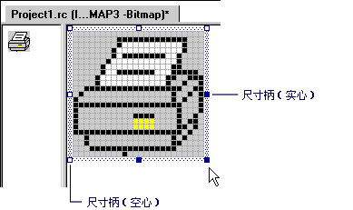

# 调整图像大小（图标的图像编辑器）
图像编辑器时调整图像的大小的行为取决于是否已[选](../windows/selecting-an-area-of-an-image-image-editor-for-icons.md)整个图像或只是它的一部分。  
  
 当所选内容包含仅映像的一部分时，图像编辑器通过删除行来缩小选定内容或列的像素和使用当前的背景色，或它填充空出的区域拉伸所选内容通过复制行或列的像素为单位。  
  
 当所选内容包括整个图像时，图像编辑器是收缩和拉伸图像，或裁剪和对其进行扩展。  
  
 调整图像大小的两种机制： 调整大小控点和[属性窗口](/visualstudio/ide/reference/properties-window)。 您可以拖动调整大小控点，若要更改的所有大小或映像的一部分。 您可以拖动的调整大小控点是实心的。 不能拖动空心的句柄。 你可以使用属性窗口来调整整个图像的大小不的选定部分。  
  
   
大小调整控点  
  
> [!NOTE]
>  如果你有中选择的平铺网格选项[网格设置对话框](../windows/grid-settings-dialog-box-image-editor-for-icons.md)，然后调整大小将下一个磁贴网格线对齐。 如果仅像素网格选项是选中 （默认设置），调整大小将对齐到下一个可用像素。  
  
-   [调整整个图像的大小](../windows/resizing-an-entire-image-image-editor-for-icons.md)  
  
-   [裁剪或扩展整个图像](cropping-or-extending-an-entire-image-image-editor-for-icons.md)  
  
-   [缩小或拉伸整个图像](../windows/shrinking-or-stretching-an-entire-image-image-editor-for-icons.md)  
  
-   [缩小或拉伸图像的一部分](../windows/shrinking-or-stretching-part-of-an-image-image-editor-for-icons.md)  
  
 有关将资源添加到托管项目的信息，请参阅[桌面应用中的资源](/dotnet/framework/resources/index)中 *.NET Framework 开发指南。* 有关手动将资源文件添加到托管项目、 访问资源、 显示静态资源和将资源字符串分配给属性的信息，请参阅[对于桌面应用程序创建资源文件](/dotnet/framework/resources/creating-resource-files-for-desktop-apps)。 全球化和本地化的资源在托管应用中的信息，请参阅[Globalizing 和本地化的.NET Framework 应用程序](/dotnet/standard/globalization-localization/index)。  
  
## 要求  
 无  
  
## 请参阅  
 [快捷键](../windows/accelerator-keys-image-editor-for-icons.md)   
 [编辑图形资源](../windows/editing-graphical-resources-image-editor-for-icons.md)   
 [图标的图像编辑器](../windows/image-editor-for-icons.md)

