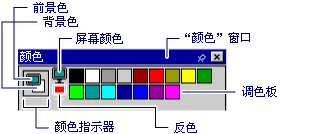

# 如何：处理颜色

**的图像编辑器**包含许多功能，尤其是处理和自定义颜色。 可以设置前景色或背景色、 有限的区域填充颜色，或选择要用作当前前景色或背景颜色的图像上的颜色。 可以在使用工具[的图像编辑器工具栏](../windows/toolbar-image-editor-for-icons.md)和中颜色调色板**颜色**窗口来创建映像。

所有颜色的单色和 16 色图像所都示**颜色**中的调色板**颜色**窗口。 除了 16 种标准颜色，还可以创建您自己的自定义颜色。 调色板中颜色的任何更改将立即更改映像中对应的颜色。

在使用 256 色图标和光标图像**颜色**属性中的[属性窗口](/visualstudio/ide/reference/properties-window)使用。 有关详细信息，请参阅[创建 256 色图标或光标](creating-a-256-color-icon-or-cursor-image-editor-for-icons.md)。

也可以创建真彩色图像。 但是，真彩色示例不会显示在完整调色板**颜色**窗口中; 它们仅在前景色或背景颜色指示符区域中显示。 使用创建真彩色**自定义颜色选择器**对话框。

可以将自定义的调色板保存在磁盘上，并根据需要重新加载它们。 最近使用的颜色调色板是保存在注册表中，并自动加载下一次启动 Visual Studio。

**颜色**窗口由两部分组成：

- **颜色调色板**，它是数组表示可以使用的颜色的颜色示例。 您可以选择要使用图形工具时选择前景色和背景色的示例。

- **颜色指示符**，其中显示的前景色和背景颜色和屏幕和反色的选择器。

    
   **颜色**窗口

> [!NOTE]
> **屏幕上颜色**并**反色**工具才可用于图标和光标。

可以使用**颜色**窗口[图像编辑器工具栏](../windows/toolbar-image-editor-for-icons.md)。

- 若要显示**颜色**窗口中，右键单击**图像编辑器**窗格，然后选择**显示颜色窗口**，或转到菜单[映像](../windows/image-menu-image-editor-for-icons.md) > **显示颜色窗口**。

- 若要隐藏**颜色**窗口中，取消固定的窗口 （此操作将允许到自动隐藏窗口时未使用），或选择**关闭**按钮。

**颜色**调色板最初显示 16 种标准颜色。 使用显示的颜色，还可以创建您自己的自定义颜色。 然后，您可以保存和加载自定义的调色板。

**自定义颜色选择器**对话框中，可自定义映像具有以下属性的使用的颜色：

|属性|描述|
|--------------------------|--------------------------|
|**渐变颜色显示**|更改所选颜色的值。  将十字线上想要更改向上或向下移动滑块可更改的亮度或颜色的 RGB 值的颜色。|
|**亮度栏**|设置中选择的颜色的亮度**渐变颜色显示**框。  选择并拖动了更高的亮度条形的白色箭头或向下的翻更少。 **颜色**框显示所选的颜色和亮度设置的效果。|
|**Color**|列出了你定义的颜色的色调 （颜色滚轮值）。 值的范围介于 0 到 240 之间，其中 0 是红色 60 为黄色，120 是绿色、 180 青色、 洋红色，可以是 200，是 240 为蓝色。|
|**Hue**|列出了你定义的颜色的色调 （颜色滚轮值）。 值的范围介于 0 到 240 之间，其中 0 是红色 60 为黄色，120 是绿色、 180 青色、 洋红色，可以是 200，是 240 为蓝色。|
|**Sat**|指定正在定义的颜色的饱和度值。 饱和度是中指定的色调颜色量。 值的范围从 0 到 240。|
|**Lum**|列出了你定义的颜色的亮度 （亮度）。 值的范围从 0 到 240。|
|**红色**|指定正在定义的颜色的红色值。 值范围从 0 到 255 之间。|
|**绿色**|指定正在定义的颜色的绿色值。 值范围从 0 到 255 之间。|
|**Blue**|指定正在定义的颜色的蓝色值。 值范围从 0 到 255 之间。|

可以保存和加载**颜色**包含自定义的颜色的调色板。 默认情况下**颜色**启动 Visual Studio 时，会自动加载最近使用的调色板。

> [!TIP]
> 由于**的图像编辑器**无法还原默认**颜色**面板中，应保存默认**颜色**如名下调色板*standard.pal*或*default.pal* ，以便可以轻松还原默认设置。

使用**加载调色板颜色**对话框中，加载要在中使用的特殊颜色调色板在C++项目具有以下属性：

|属性|描述|
|-----------------|-----------------|
|**查找范围**|指定你想要查找文件或文件夹的位置。  选择箭头以选择另一个位置，或选择级别上移工具栏上的文件夹图标。|
|**文件的名称**|提供空间以键入你想要打开的文件的名称。  若要快速查找以前打开过的文件，选择的文件的名称在下拉列表中，如果可用。  如果您要搜索的文件，您可以使用星号 （*） 作为通配符。 例如，您可以键入\*。\*若要查看所有文件的列表。 此外可以键入文件的完整路径，如*C:\My Documents\MyColorPalette.pal*或 *\\\NetworkServer\MyFolder\MyColorPalette.pal*。|
|**文件类型**|列出了用于显示文件的类型。  调色板 (*.pal) 是调色板的默认文件类型。|

## 操作说明

### 若要选择前景色或背景颜色

除**橡皮擦**，工具上**图像编辑器**使用当前前景色或背景色时分别按鼠标左键或右键按钮，工具栏绘图。

- 若要选择前景色，用鼠标右键，选择在所需的颜色**颜色**调色板。

- 若要选择背景色，用鼠标右键，选择在所需的颜色**颜色**调色板。

### 若要用颜色填充图像的封闭的区域

**的图像编辑器**提供**填充**工具，用于填充任何封闭用当前绘制颜色或当前的背景色的图像区域。

### 若要使用填充工具

1. 使用**的图像编辑器**工具栏或转到菜单**映像** > **工具**，然后选择**填充**工具。

1. 如有必要，选择绘制颜色。 在中[颜色调色板](../windows/colors-window-image-editor-for-icons.md)，选择以选择前景色的鼠标按钮或鼠标右键按钮以选择背景色。

1. 移动**填充**工具配置想要填充的区域。

1. 选择用于分别填充的前景色或背景色的左侧或右侧鼠标按钮。

### 若要获得从图像颜色用于其他位置

**选择颜色**，或颜色选取工具使图像上的任何颜色的当前前景色或背景色，具体取决于您是按下的左侧或右侧鼠标按钮。 若要取消**选择颜色**工具中，选择另一个工具。

1. 使用**的图像编辑器**工具栏或转到菜单**映像** > **工具**，然后选择**选择颜色**工具。

1. 选择你想要从图像的颜色。

   > [!NOTE]
   > 选取一种颜色之后,**的图像编辑器**激活最近使用的工具。

1. 绘制使用鼠标左键的前景色或鼠标右按钮的背景颜色。

### 若要选择背景

当您移动或复制选择映像时，匹配当前的背景色在所选内容中任何像素是，默认情况下，透明和它们变得模糊的目标位置的像素为单位。

可以从透明背景 （默认值） 切换到不透明背景，并后又返回。 当使用选择工具时，**透明背景**并**不透明背景**选项出现在**选项**上的选择器**的图像编辑器**工具栏。

 
**透明且不透明选项**上**的图像编辑器工具栏**

#### 若要切换透明且不透明背景

在中**的图像编辑器**工具栏中，选择**选项**选择器，然后选择适当的背景：

- **不透明背景 (O)**:现有的映像将被遮盖的所选内容的所有部件。

- **透明背景 (T)**:现有图显示了与当前的背景色匹配所选内容的部件。

> [!TIP]
> 一个快捷方式，在**图像**菜单上，选中或清除**绘制不透明**。

选择已在要更改的图像的哪些部分是透明的效果时，可以更改背景色。

### 若要反转所选内容中颜色

**的图像编辑器**提供了反色中所选映像的一部分，以便您可以知道图像将如何显示颜色反转之后的简便方法。

若要反转当前选定内容中的颜色，请转到菜单**图像** > **反色**。

### 若要自定义或更改调色板上的颜色的颜色

1. 转到菜单**图像** > **调整颜色**。

1. 在中**自定义颜色选择器**对话框框中，通过在相应的文本框中键入 RGB 或 HSL 值定义的颜色或选择中的颜色**渐变颜色显示**框。

1. 通过移动滑块来设置亮度**亮度**栏。

1. 许多自定义颜色是抖色。 如果要纯色最接近于抖色，双击**颜色**框。

   如果你以后决定要抖的色，移动滑块**亮度**条形图或将十字线移**渐变颜色显示**框再次还原抖色。

1. 选择**确定**以添加新的颜色。

### 保存自定义调色板

1. 转到菜单**图像** > **保存调色板**。

1. 导航到要用于保存调色板的目录并键入调色板的名称。

1. 选择“保存”。

### 加载自定义调色板

1. 转到菜单**图像** > **加载调色板**。

1. 在中**加载调色板**对话框框中，导航到正确的目录并选择你想要加载的调色板。 **颜色**使用.pal 文件扩展名保存调色板。

## 要求

None

## 请参阅

[图标的图像编辑器](../windows/image-editor-for-icons.md) 
[如何：创建图标或其他图像](../windows/creating-an-icon-or-other-image-image-editor-for-icons.md) 
[如何：编辑图像](../windows/selecting-an-area-of-an-image-image-editor-for-icons.md) 
[如何：使用绘图工具](../windows/using-a-drawing-tool-image-editor-for-icons.md) 
[快捷键](../windows/accelerator-keys-image-editor-for-icons.md) 
